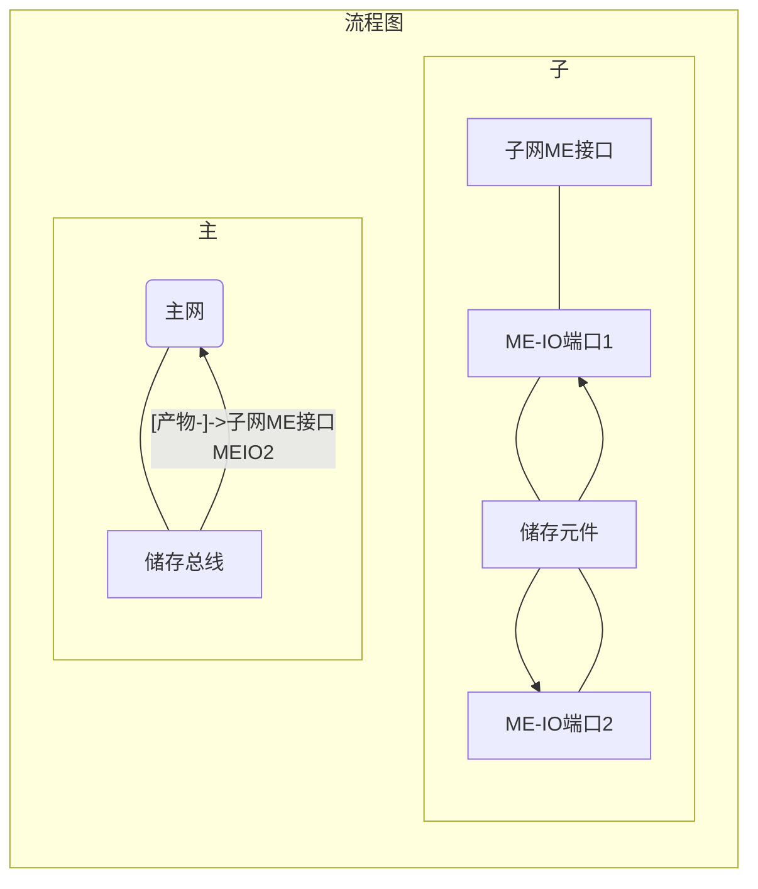
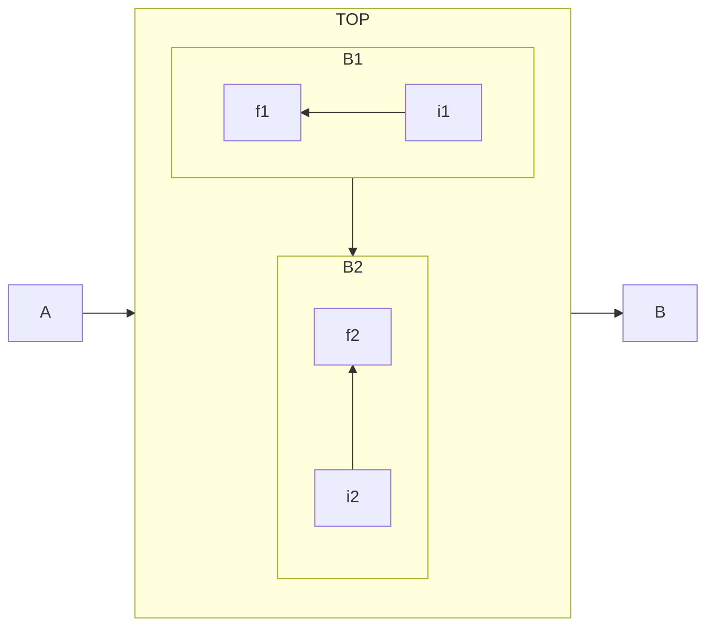

# 3.1 伪合成（高级发包）

## &#x20;「伪合成」的定义 

「伪合成」的实质，就是发起合成后，欺骗合成储存器，让她以为合成已经完成，从而解除“正在合成”状态。

## 「伪合成」的原理 

「伪合成」能完成合成操作，是将合成原料分成多段，将其分别发送同一个子网，子网能做出最终产物返回主网。

「伪合成」样板的制作：样板终端在制作时选择**处理样板模式**，第一个样板的**产物**  为第二个样板的**原料**，后同，原料——产物依次排列。

其中第一个样板  放置的ME接口的模式应是”当容器内有物品时不传送物品“，其他样板放在正常ME接口中。这样能保证一次只发送一次物品，就可以用[2.4 卡合成](../2-相关的概念与实现/2.4-指示物.md#\_toc137910917)来实现「伪合成」了

<figure><figcaption>
图3.1-1
</figcaption></figure>

<figure><figcaption>
图3.1 经典结构
</figcaption></figure>

1、在图3.1-1鼠标指向的储存总线中   标记全部「伪合成」样板中的「产物」，优先级调高。就能实现所有进入主网络（绿）的「产物」优先进该子网。（「产物」应该选择永远不会在AE2中参与合成的物品）

2、旁边的结构，能把进入该子网的所有物品再返还主网，然后和1、一起就会形成无限循环。所以「产物」既在主网中，又不在主网中。

3、当发起合成的时候，因为「产物」缺失，所以可以发起合成。发起合成后，又因为「产物」在主网中，因此认定合成完成，于是取消“正在合成”状态。

发起合成通过ME接口进行，于是“原料”被发送到了对应的容器里，就此「伪合成」发送部分完成。

## 伪合成的作用 

可以利用多个样板，实现超过9种物品的合成或者[「发包」](../2-相关的概念与实现/2.3-发包.md)。
