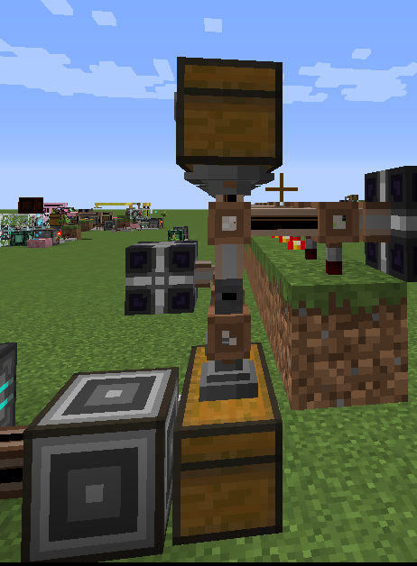

# 3.4 传送机

## 设计说明

有什么好说的？传送机还不帅？

## 实现

### 第一种实现

明确任务：把实体从A地点，传送到B地点，A、B是网络任意的传送点。设计要能重复使用，要便于操作。

根据空间IO端口的性质，设计如下

第一步设计物流：

网络（空间储存元件）-->A子网的空间IO端口-->网络-->B子网的空间IO端口-->网络

进一步设计红石序列（按激活顺序排列）：

主网的A地址输出总线（主网任取一空的空间储存元件）-->A地址空间IO端口(简称A端)-->子网的A地址输入总线-->子网à子网的B地址输出总线（已经存储数据的空间储存元件）-->B端-->主网的B地址输入总线（还原成空的空间储存元件）。

<figure><figcaption>
复杂的实现
</figcaption></figure>

图中粉红色线缆是主网，红色和绿色线缆是子网。

#### 第一代设计思路 

用无线终端，利用伪合成，将“指示物”送进子网。打包机把已使用的空间储存元件和“指示物”打包，送到子网中选择地址，子网将元件送回空间IO端口，将指示物送回主网。

第一代设计流程图：

<figure><figcaption>
复杂
</figcaption></figure>

实现

<figure><figcaption></figcaption></figure>

<figure><figcaption>
复杂
</figcaption></figure>

#### 第二代设计思路 

观察第一代的流程图可以发现，“指示物”在空间元件进入子网之前，并没有什么作用，因此可以节省打包的操作，直接让“指示物“进入后面的子网。这样可以减少一部分结构。

第二代流程图：

<figure><figcaption></figcaption></figure>

实现

<figure><figcaption></figcaption></figure>

<figure><figcaption></figcaption></figure>

#### 第三种实现

其实，在设计的时候，忽略了一个重要的东西。每一个传送机在设计时都只设计了一个空间IO端口，但是实际上传送机可以有不只一个空间IO端口。如果用两个分别处理输入输出，红石控制能减少很多。同时，可以不使用伪合成，配合ME存储总线进行选址，能减少一个伪合成子网，每台传送机只会占用主网频道2个。思路来源（DoremySwee等）

这个比前两个都简单，所以建议自己设计一下，这里不放流程图，可以自己尝试画画。

实现：

<figure><figcaption>
小巧精致（20分钟做的没优化结构）
</figcaption></figure>
