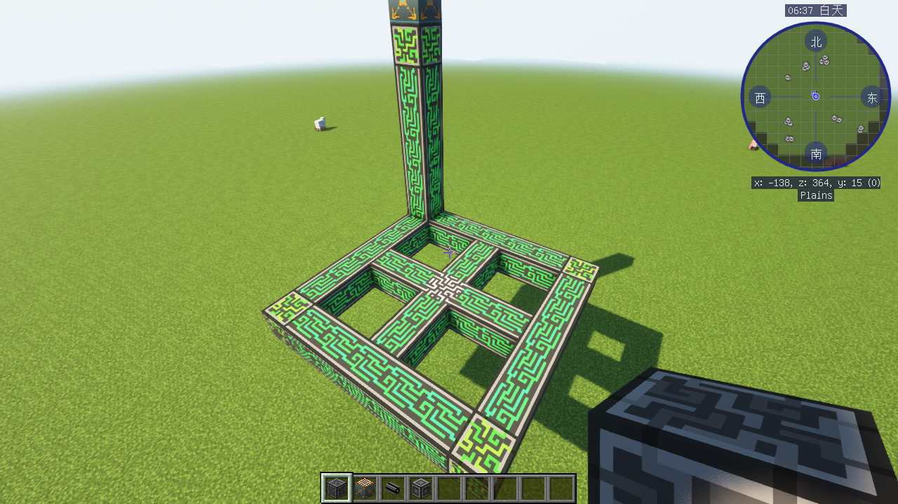

# ME控制器

一个网络中只能有一个me控制器，但这指的是一个控制器结构，控制器结构可以由很多控制器组成，最大为7x7x7，当然不一定要造那么大。

<figure><figcaption>
（希望没人按我这样搭）
</figcaption></figure>

需要注意的是，me控制器不能在任意一个平面内与四个控制器相邻，否则就这一个控制器方块就为无效控制器，如图中的灰色控制器，无法接入网络也不能接出频道。

一般来讲，这时候会将这个控制器替换为能源元件。
