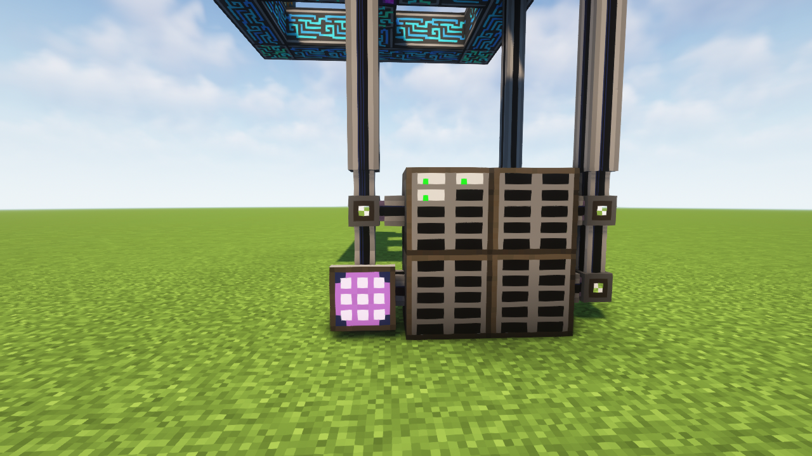

# 存储

我们需要me驱动器放入存储元件，连接上AE网络，这时候，我们就可以在终端放入查看AE网络内的物品了。使用合成终端还可以直接使用ae网络内的物品进行合成。

<figure><figcaption>
我知道这结构并不好&#x26;
</figcaption></figure>

当存储元件显示为绿色时说明工作正常，黄色时说明物品种类已满，无法存入已有种类之外的物品，红色时说明字节已经使用满，即无法存入任何物品。

## 存储元件

存储元件有1k到64k不同的类别。对一个Nk存储元件来讲。（N为整数）

总字节数=已用类型数\*N\*8+总物品数/8

字节总量：N\*1024字节

耗能：0.5\*(log4N)+0.5 AE/t

举个例子，一个1k存储元件只存圆石，1种物品会占用8个字节，剩下1016个字节可以存储1016x8=8128个物品。
