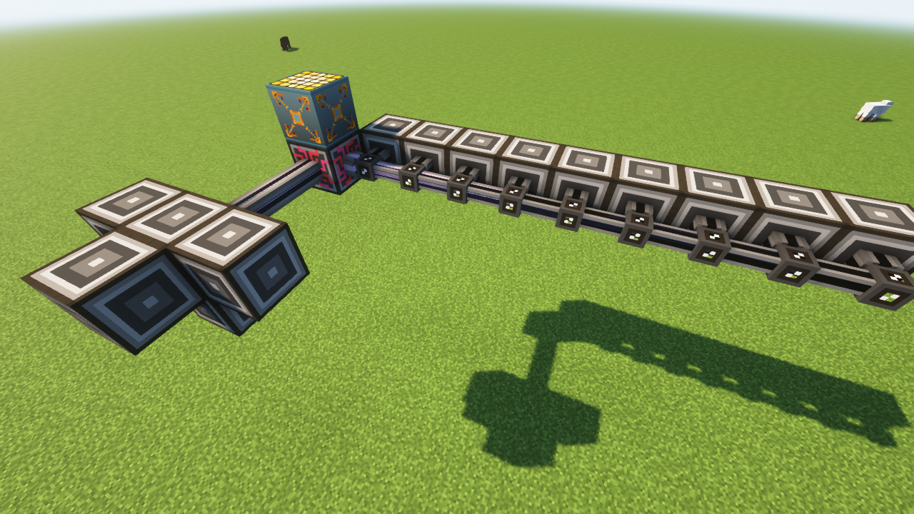

# 频道

很多ae设备都需要占用频道，如:me接口，驱动器，me终端等，当频道占用超过上限时，就会造成ae网络停止工作。

\
在没有ME控制器时，频道上限为8，频道为公用，并且频道一旦超过就会使整个AE多方块结构停止工作。

有me控制器时，频道从me控制器的任意一个面出发，比如从me控制器的一个面放智能线缆，有9个占用频道的设备，仅仅是超过频道数量上限的设备不工作。

<figure><figcaption>
一个没有作用的网络
</figcaption></figure>

如图，我们可以看到从一个面出发，智能线缆传递的频道数量逐渐减少，到最右侧的me接口时，已经没有频道可供这个me接口使用了。

同时，可以看到，me控制器每个面的频道是独立的，右侧的频道满了，但从另外的方向仍可拉出频道。

## 频道的传递

智能线缆最大可以传递8个频道，致密线缆可以传递32个频道，设备可以传递包括自己在内的8个频道。
