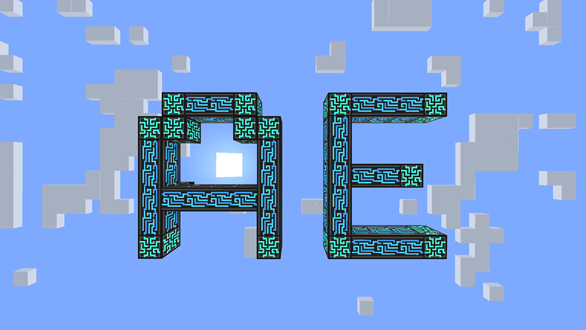

# 前言

<figure><figcaption>
AE god
</figcaption></figure>

## AE2 Wiki Summary

* [前言](README.md)
* [1 绪论](1-绪论.md)
* [2 相关的概念与结构实现](2-相关的概念与实现/README.md)
  * [2.1 ME管道传输](2-相关的概念与实现/2.1-ME管道传输.md)
  * [2.2 子网](2-相关的概念与实现/2.2-子网.md)
  * [2.3 包](2-相关的概念与实现/2.3-包.md)
  * [2.4 指示物](2-相关的概念与实现/2.4-指示物.md)
  * [2.5 合成控制](2-相关的概念与实现/2.5-合成控制.md)
* [3 常用进阶实现](3-常用进阶实现/README.md)
  * [3.1 发配单份原料](3-常用进阶实现/3.1-发配单份原料（高级发包）.md)
  * [3.2 伪合成（高级发包）](3-常用进阶实现/3.2-伪合成（高级发包）.md)
  * [3.3 单点对多点发包](3-常用进阶实现/3.3-单点对多点发包.md)
  * [3.4 倒序装填](3-常用进阶实现/3.4-倒序装填.md)
* [4 实例](4-实例/README.md)
  * [4.1 植物魔法符文祭坛](4-实例/4.1-植物魔法符文祭坛.md)
  * [4.2 传送机](4-实例/4.2-传送机.md)
* [5 参考文献](5-参考文献.md)
